# Hahn Leave & Absence Management

A full-stack Leave & Absence system with a **.NET backend**, **Angular frontend**, and **SQL Server** database.  
Run everything locally with **Docker Compose** — no manual installs required.

---

## Quick Summary (2–3 lines)

Manage employee leave requests end-to-end: submit, approve, track, and report.  
Backend exposes a clean REST API; frontend gives a clean HR/user experience.  
Ships with Docker for a one-command local setup.

---

## Stack

- **Frontend:** Angular 17 (served via Nginx)
- **Backend:** .NET 9 (Web API)
- **DB:** SQL Server 2022
- **Orchestration:** Docker & Docker Compose

---

## Prerequisites

- [Docker Desktop](https://www.docker.com/) (or Docker Engine) installed
- Git installed

---

## 1-Minute Start (Docker)

```bash
# 1) Clone the repo
git clone https://github.com/Ziadkad/Hahn-Leave-Absence-Management.git
cd Hahn-Leave-Absence-Management

# 2) Bring everything up
docker compose up --build -d

# 3) Check that all 3 containers are healthy/running
docker compose ps

# 4) Open the apps:
# Frontend (Angular via Nginx):
#   http://localhost:4200
# Backend API (Swagger, if enabled by the build profile):
#   http://localhost:4000/swagger

```
## Features

- Authentication (sign in / sign out, JWT)
- User Management
- Leave Requests (create/cancel, list & filter, approvals / rejections)
- Health (liveness/readiness checks for container orchestration)


---

## Screenshots

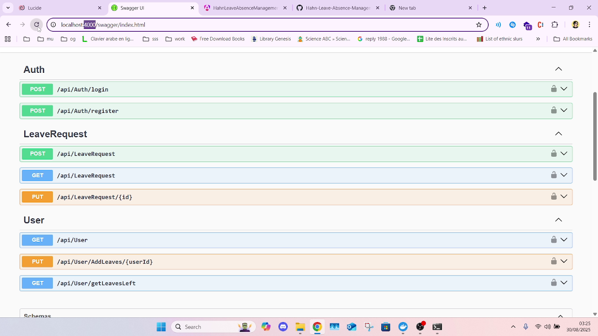
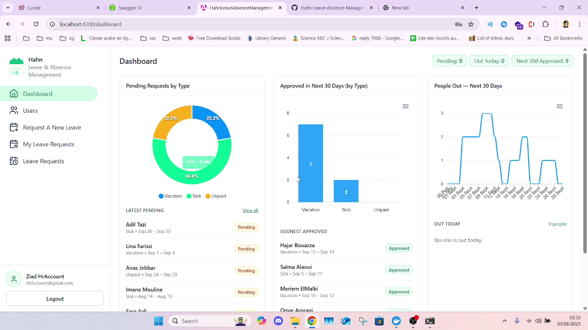
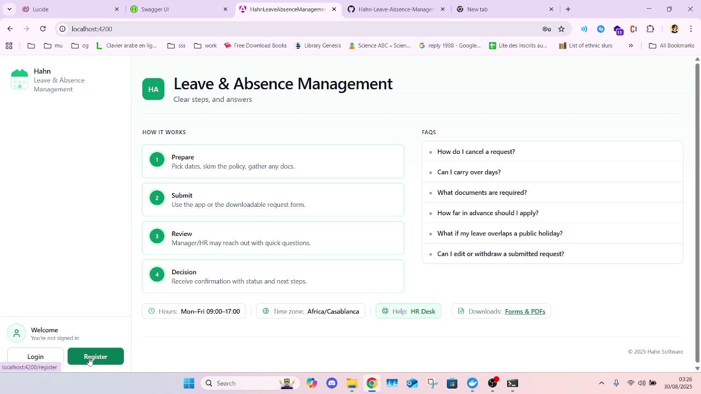
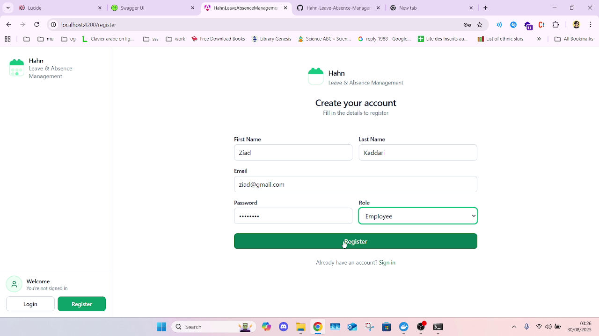
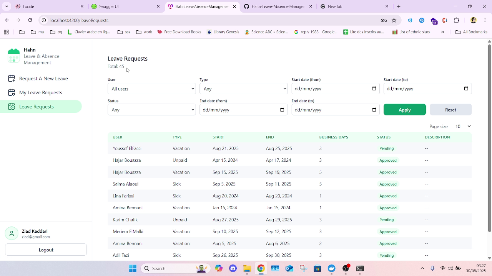
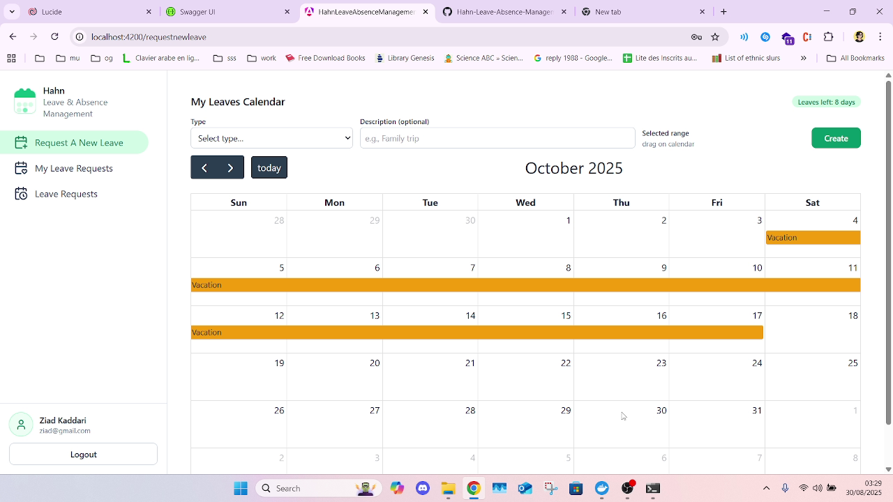
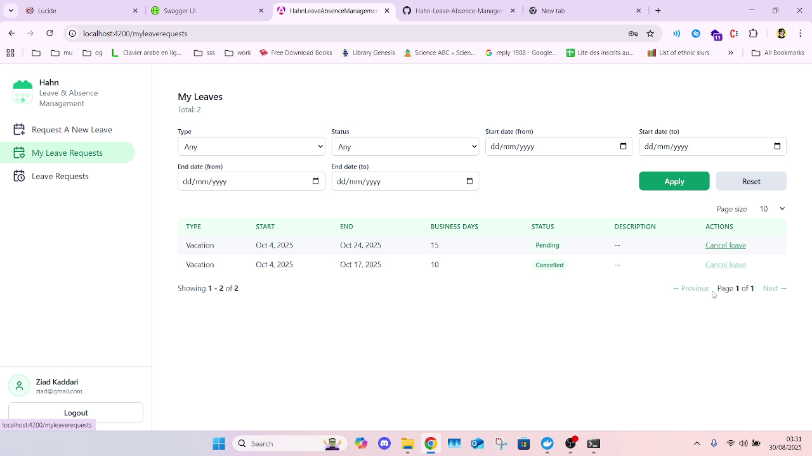
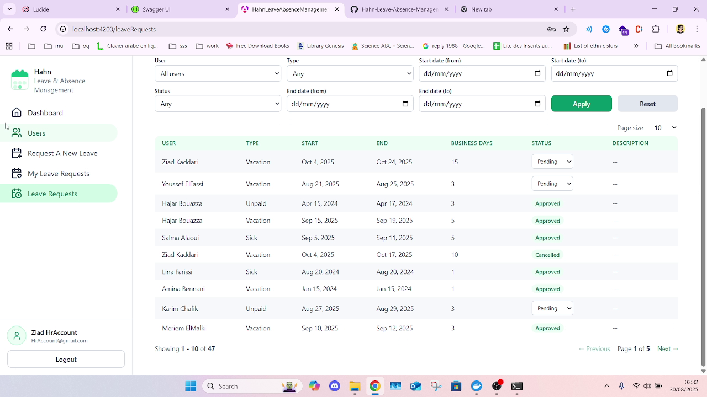
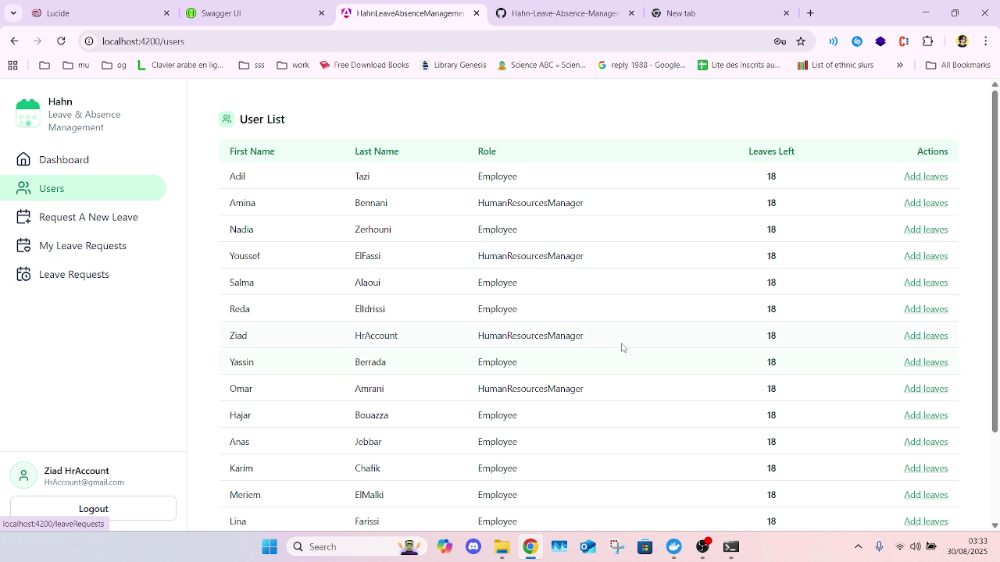
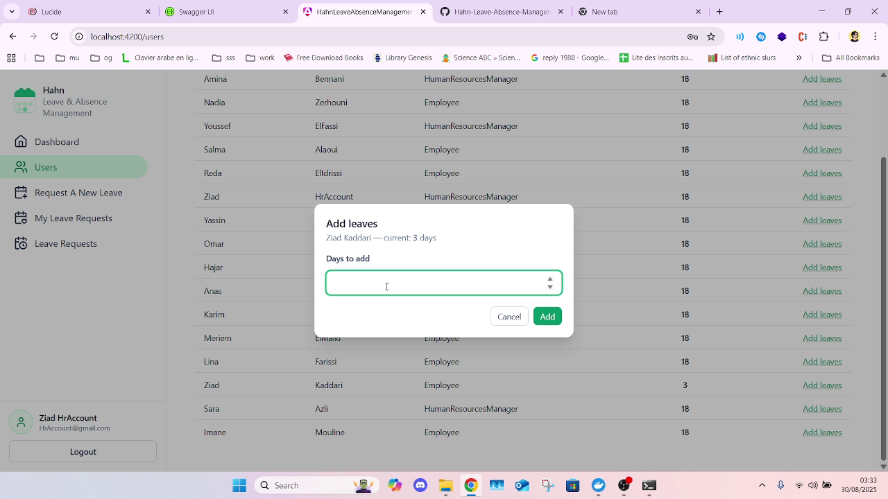
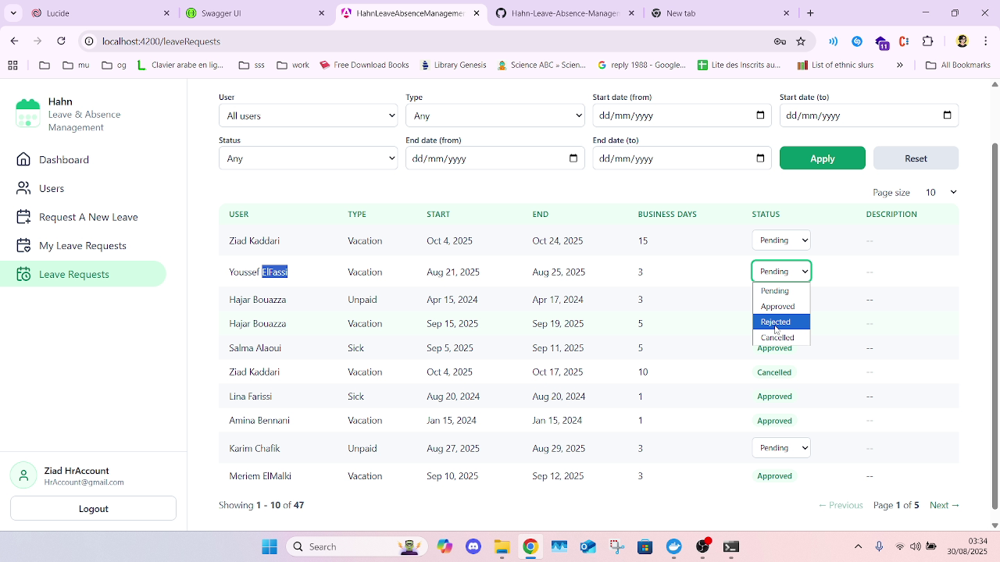